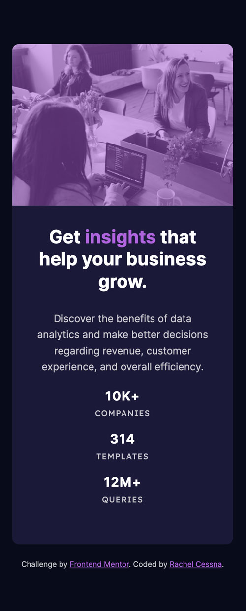
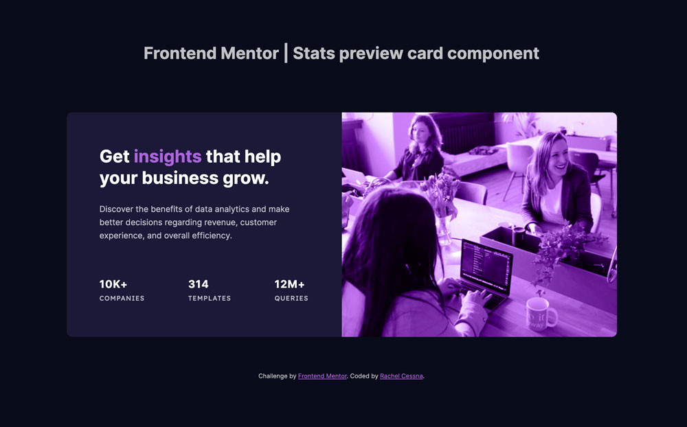

# Frontend Mentor - Stats preview card component solution

This is a solution to the [Stats preview card component challenge on Frontend Mentor](https://www.frontendmentor.io/challenges/stats-preview-card-component-8JqbgoU62). Frontend Mentor challenges help you improve your coding skills by building realistic projects. 

## Table of contents

- [Overview](#overview)
  - [The challenge](#the-challenge)
  - [Screenshot](#screenshot)
  - [Links](#links)
- [My process](#my-process)
  - [Built with](#built-with)
  - [What I learned](#what-i-learned)
  - [Continued development](#continued-development)
  - [Useful resources](#useful-resources)
- [Author](#author)

## Overview

### The challenge

Users should be able to:

- View the optimal layout depending on their device's screen size

### Screenshot

#### Mobile Layout



#### Desktop Layout



### Links

- Solution URL: [GitHub Repo](https://github.com/cessnar516/FM-stats-preview-card)
- Live Site URL: [GitHub Pages](https://cessnar516.github.io/FM-stats-preview-card/)

## My process

### Built with

- Semantic HTML5 markup
- SASS
- CSS Grid
- Flexbox
- Mobile-first workflow

### What I learned

For this challenge, I experimented with combining CSS Grid and Flexbox containers. The card itself is a grid container, and the UL inside of it displaying the three stats is a flex container. On mobile screens, the flex container is set to `flex-direction: column`, and on desktop screens it changes to `flex-direction: row`. Initially, I set the card to `display: flex`, but I was able to control the size of the background image better by using `display: grid` instead. 

Originally, I chose to display the image as a background image and applied a linear-gradient over top to achieve the color overlay; however, I was not able to exactly replicate the challenge design image. 

Thanks to the feedback I received from the Frontend Mentor community, I was able to achieve the intended overlay using the background-blend-mode property. Here's the revised CSS:

```css
.stats-image {
  background-color: hsl(277, 64%, 63%);
  background-image: url("../images/image-header-mobile.jpg");
  background-blend-mode: luminosity;
}

```

After receiving feedback from the Frontend Mentor community, I also chose to revise the screen width at which the desktop layout was implemented. The 1440px recommended in the challenge style guide was quite large, and one of the community members mentioned needing to zoom out on their screen to trigger the desktop layout. For that reason, I decreased the minimum screen width in the media querry to 900px. 

### Accessibility Note

The purple accent color did not have sufficient color contrast to meet the WCAG AA requirement, so I adjusted it slightly. The original value from the style guide was `hsl(277, 64%, 61%)`, and I used `hsl(277, 64%, 63%)` instead. Having sufficient color contrast is important because it allows individuals with low vision and/or color blindness to read the information. 

### Continued development

The background image and color overlay gave me a lot of trouble with this challenge, so I need more practice with those. I also plan to continue to experiment with CSS Grid and Flexbox.

### Useful resources

- [CSS Tricks - A Complete Guide to Flexbox](https://css-tricks.com/snippets/css/a-guide-to-flexbox/) - This website has great information about using Flexbox, including lots of code examples and illustrations.

- [CSS Tricks - background-blend-mode](https://css-tricks.com/almanac/properties/b/background-blend-mode/) - This was the property I ended up using to achieve the color overlay on the image.

## Author

- LinkedIn - [Rachel Cessna](https://www.linkedin.com/in/rachelacessna/)
- Frontend Mentor - [@cessnar516](https://www.frontendmentor.io/profile/cessnar516)
- CodePen - [@cessnar](https://codepen.io/cessnar)

## Acknowledgements

Thanks to Frontend Mentor community members @ammonschiffer, @cornelisgijsbert, and @pikamart for their feedback on my initial submission!
