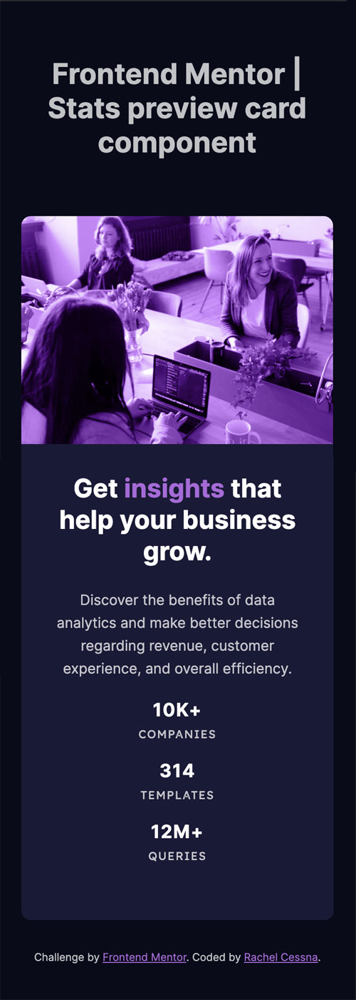

# Frontend Mentor - Stats preview card component solution

This is a solution to the [Stats preview card component challenge on Frontend Mentor](https://www.frontendmentor.io/challenges/stats-preview-card-component-8JqbgoU62). Frontend Mentor challenges help you improve your coding skills by building realistic projects. 

## Table of contents

- [Overview](#overview)
  - [The challenge](#the-challenge)
  - [Screenshot](#screenshot)
  - [Links](#links)
- [My process](#my-process)
  - [Built with](#built-with)
  - [What I learned](#what-i-learned)
  - [Continued development](#continued-development)
  - [Useful resources](#useful-resources)
- [Author](#author)

## Overview

### The challenge

Users should be able to:

- View the optimal layout depending on their device's screen size

### Screenshot

#### Mobile Layout

#### Desktop Layout

### Links

- Solution URL: [GitHub Repo](https://github.com/cessnar516/FM-stats-preview-card)
- Live Site URL: [GitHub Pages](https://cessnar516.github.io/FM-stats-preview-card/)

## My process

### Built with

- Semantic HTML5 markup
- SASS
- Flexbox
- Mobile-first workflow

### What I learned

For this challenge, I experimented with nested flexbox elements. The card itself is a flex container, and then the UL inside of it displaying the three stats is also a flex container. On mobile screens, both flex containers are set to `flex-direction: column`, and on desktop screens they change to `flex-direction: row`. 

I chose to display the image as a background image and applied a linear-gradient over top to achieve the color overlay; however, I was not able to exactly replicate the challenge design image. 

### Accessibility Note

The purple accent color did not have sufficient color contrast to meet the WCAG AA requirement, so I adjusted it slightly. The original value from the style guide was `hsl(277, 64%, 61%)`, and I used `hsl(277, 64%, 63%)` instead. Having sufficient color contrast is important because it allows individuals with low vision and/or color blindness to read the information. 

### Continued development

The background image and color overlay gave me a lot of trouble with this challenge, so I need more practice with those. 

### Useful resources

- [CSS Tricks - A Complete Guide to Flexbox](https://css-tricks.com/snippets/css/a-guide-to-flexbox/) - This website has great information about using Flexbox, including lots of code examples and illustrations.

## Author

- LinkedIn - [Rachel Cessna](https://www.linkedin.com/in/rachelacessna/)
- Frontend Mentor - [@cessnar516](https://www.frontendmentor.io/profile/cessnar516)
- CodePen - [@cessnar](https://codepen.io/cessnar)
